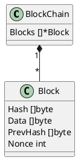

# Golang Blockchain

## data model

```plantuml
@startuml
class BlockChain {
    Blocks []*Block
}

class Block {
    Hash []byte
    Data []byte
    PrevHash []byte
    Nonce int
}

BlockChain "1" *-- "*" Block
@enduml
```

