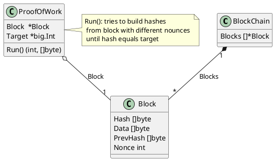

# Golang Blockchain

## data model

```plantuml
@startuml
class BlockChain {
    Blocks []*Block
}

class Block {
    Hash []byte
    Data []byte
    PrevHash []byte
    Nonce int
}

BlockChain "1" *-- "*" Block : Blocks

class ProofOfWork {
    Block  *Block
	Target *big.Int
    Run() (int, []byte)
}
note right of ProofOfWork : Run(): tries to build hashes \n from block with different nounces \n until hash equals target

ProofOfWork  o-- "1" Block : Block
@enduml
```

