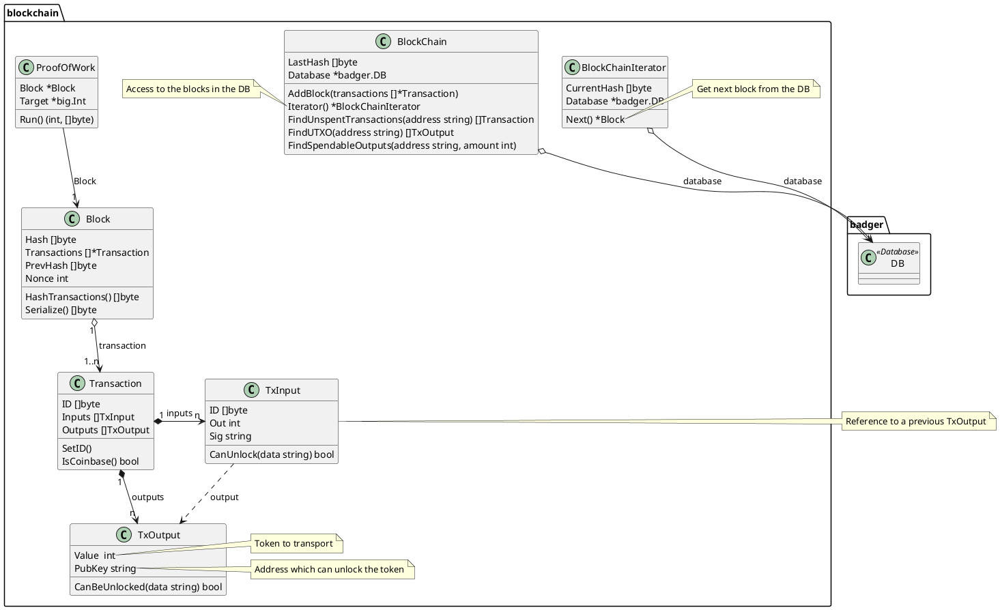

# Golang Blockchain

## data model

```plantuml
@startuml

class blockchain.BlockChain {
    LastHash []byte
    Database *badger.DB
    AddBlock(transactions []*Transaction)
    Iterator() *BlockChainIterator
    FindUnspentTransactions(address string) []Transaction
    FindUTXO(address string) []TxOutput
    FindSpendableOutputs(address string, amount int)
}

note left of blockchain.BlockChain::Iterator
  Access to the blocks in the DB
end note

class blockchain.BlockChainIterator {
    CurrentHash []byte
    Database *badger.DB
    Next() *Block
}

note right of blockchain.BlockChainIterator::Next
  Get next block from the DB
end note

class badger.DB << Database >>


class blockchain.Block {
    Hash []byte
    Transactions []*Transaction
    PrevHash []byte
    Nonce int
    HashTransactions() []byte
    Serialize() []byte
}

class blockchain.ProofOfWork {
    Block *Block
    Target *big.Int
    Run() (int, []byte)
}


blockchain.ProofOfWork --> "1" blockchain.Block : Block

blockchain.BlockChain o--> badger.DB : database
blockchain.BlockChainIterator o--> badger.DB : database
blockchain.Block "1" o--> "1..n" blockchain.Transaction : transaction

class blockchain.Transaction {
    ID []byte
    Inputs []TxInput
    Outputs []TxOutput
    SetID()
    IsCoinbase() bool
}

class blockchain.TxInput {
    ID []byte
    Out int
    Sig string
    CanUnlock(data string) bool
}


class blockchain.TxOutput  {
    Value  int
    PubKey string
    CanBeUnlocked(data string) bool
}

note right of blockchain.TxInput
  Reference to a previous TxOutput
end note

note right of blockchain.TxOutput::Value
  Token to transport
end note

note right of blockchain.TxOutput::PubKey
  Address which can unlock the token
end note

blockchain.Transaction "1" *-> "n" blockchain.TxInput : inputs
blockchain.Transaction "1" *--> "n" blockchain.TxOutput : outputs
blockchain.TxInput ..> blockchain.TxOutput : output
@enduml
```

